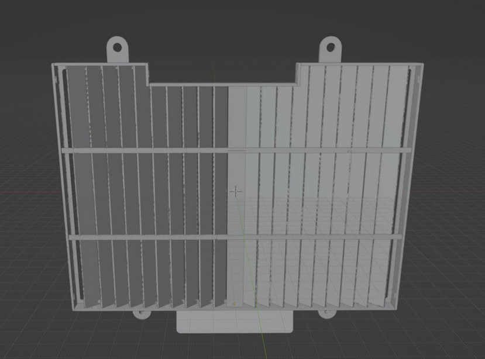

## Radiator Guard

* __Project status:__ Prototype Tested
* __Printing Caveat:__ Use heat resistent material
* [STL file preview and download](https://github.com/normanzb/g310gs/blob/master/release/23_03_20/radiator%20guard.stl)

What prevents most people front removing the front mud guard is the rocks or sand blasting from the front wheel can damage the radiator fins. And all the after market radiator guards you can buy are just a thin layer of metal that only protect against small rocks but still allowing the sand particles to go through.

If you look carefully, almost all the off road oriented bikes, including all the MX/enduro bikes and KTM 890 ADV and yamaha tenere 700, they all come equiped a stock radiator guard that consist of a series louvre blades. These blades not only protect against rocks but also sand blasting.

Below are few examples:

_Stock Radiator Guard on tenere 700_

_Stock Radiator Guard on KTM 890 adv_

_Almost all MX bikes have fitted with louvre blades_

Our radiator guard tries to achieve the same by adding the louvre blades, you can also secure a piece of drain grill mesh on top of it with a ziptie to add some more protection against rocks.

_We added holes on the radiator guard so that you can secure a piece of drain grill mesh with a ziptie on it_

_You can fit metal mesh from ebay to add some more protection_