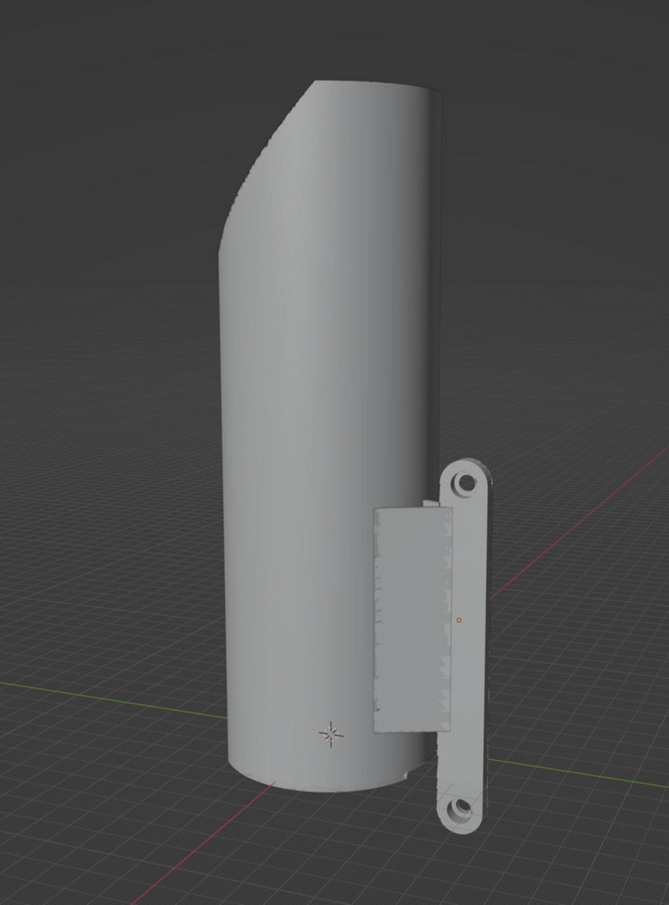

# Norm's G310GS mods

Welcome to open source repo for all 3D parts that designed for making G310GS more off roady.

Second hand G310GS on the market is a lot more affordable and more versatile then a brand new Honda CRF300L, but when it comes to greenlaning there are improvements to be done to make the baby GS more prepared for the technical terrain.

That's why I created this repo here to share the mods that I made, in the process of improving my own G310GS.

## Disclaimer: Use at your own discretion

Bike parts can be changed overtime or be completely different when it is sold in different region. The part in this repo might not fit straight to your bike.
Authors of this repo do not responsible for any damage caused by the mods made to your property, vehicle or health.

## Mods

[TLDR, take me to the STL files!](https://github.com/normanzb/g310gs/blob/master/release/22_04_25)

### Removing the front mudguard

The baby GS comes with the classic GS beaky look with a lower front mud guard that provides a better high speed motorway riding experience. However in very muddy condition the lower front mud guard can clog up with muds and stop the front wheel from spinning. This makes the bike unrideable until the clearance is re-gained by removing the front mud guard. 

Below parts help you to remove the front mud guard while still providing protection for the vulnerable parts:

#### Radiator Guard

* __Project status:__ Prototype Tested
* __Printing Caveat:__ Use heat resistent material
* [STL file preview and download](https://github.com/normanzb/g310gs/blob/master/release/22_04_25/radiator%20guard.stl)

What prevents most people front removing the front mud guard is the rocks or sand blasting from the front wheel can damage the radiator fins. And all the after market radiator guards you can buy are just a thin layer of metal that only protect against small rocks but still allowing the sand particles to go through.

If you look carefully, almost all the off road oriented bikes, including all the MX/enduro bikes and KTM 890 ADV and yamaha tenere 700, they all come equiped a stock radiator guard that consist of a series louvre blades. These blades not only protect against rocks but also sand blasting.

Below are few examples:

_Stock Radiator Guard on tenere 700_

_Stock Radiator Guard on KTM 890 adv_

_Almost all MX bikes have fitted with louvre blades_

Our radiator guard tries to achieve the same by adding the louvre blades, you can also secure a piece of drain grill mesh on top of it with a ziptie to add some more protection against rocks.

_We added holes on the radiator guard so that you can secure a piece of drain grill mesh with a ziptie on it_

_You can fit metal mesh from ebay to add some more protection_

#### Right Front Fork Guard

* __Project status:__ Fully Tested
* [STL file preview and download](https://github.com/normanzb/g310gs/blob/master/release/22_04_25/mudguard%20alt%20right.stl)

#### Left Front Fork Guard

* __Project status:__ Fully Tested
* [STL file preview and download](https://github.com/normanzb/g310gs/blob/master/release/22_04_25/mudguard%20alt%20left.stl)

### Better stand up posture

#### Brake riser

* __Project status:__ Fully Tested
* [STL file preview and download](https://github.com/normanzb/g310gs/blob/master/release/22_04_25/brake%20riser.stl)

This brake riser replaces the top bit of [this cheap ebay brake extension](https://www.ebay.co.uk/itm/384765039930?_trkparms=ispr%3D1&hash=item5995c8953a:g:sMEAAOSwG5piIaeH&amdata=enc%3AAQAGAAAA8HYUk%2BtJEiJvjREW2gZcTXGnK7oytC2VH4SUFmnNXlFIl8NIefNd1MWzZ2WOmM8PlnRj7bvQibiVS03FSIIvpIeS7W1RhDzucNHZkijui%2BVty%2ByEhm66sPcBbvrT15cXPAX817B0iiYRUVD4BebPqxqQ9QId2vmKfurddC3Lxid%2FxzFwh4PmLk56R3Qq9q5YsmEdF9bvr%2FiN7%2BjmKzK%2FSooQgLWpI44ooTX3dxLnwGCXtXkZtPRa%2F%2FGVSRQvufj2f47fXFOqGqGYe2uy5It6%2FVbCaGXo85wQ8YWuqt8OUKQlY%2Fp28bLnL5cxl4cigHiTfg%3D%3D%7Ctkp%3ABFBMpNiQy4tg):

## Please Help!

Designing and testing motorbike mods are time consuming and costly, I had to print out the parts, install them on my bike, identify the problems and re-do the design and printing. Each time just the printing along cost me somewhere around £30 to £180. Also in the process I was risking breaking the parts on my bike.

I know it's paying for my own habit, but if this project is helpful to you, please consider donate a little to help keeping the project going.

__I accept ETH on:__

0xC506739D39cBf1D94E2510bfcA64Cb6015F4Bb1B

__Buy me a drink on paypal:__

https://paypal.me/norx