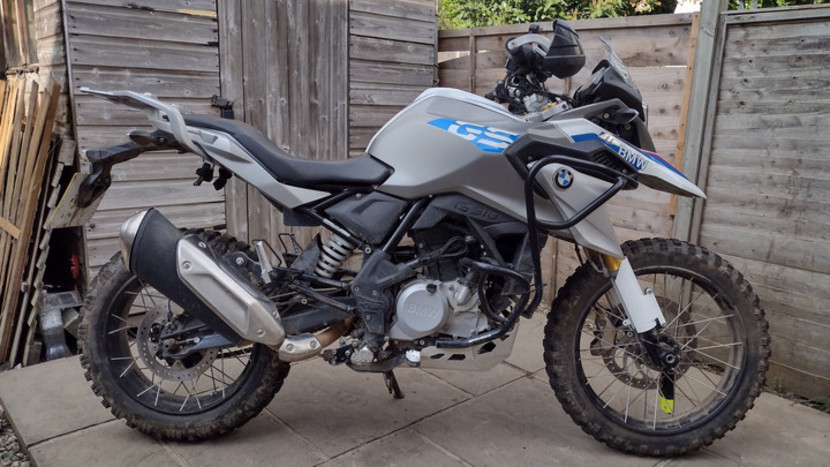

# Norm's G310GS mods

Welcome to open source repo of my g310gs mods repo.

Second hand G310GS on the market is a lot more affordable and more versatile then a brand new Honda CRF300L, however, when it comes to greenlaning there are improvements to be done to make the baby GS more prepared in the technical terrains.

Here you will find the mods that I made to improve my own g310gs to make it more capable off road.

## Disclaimer: Use at your own discretion

Bike parts can be changed overtime, they can also be completely different shape when it is sold in different region. The part in this repo might not fit straight to your bike.
Authors of this repo do not responsible for any damage caused by the mods made to your property, vehicle or health.

## Mods

--> __[TLDR, straight to the STL files!](https://github.com/normanzb/g310gs/blob/master/release/23_03_20)__ <--

### Removing the front mudguard

The baby GS comes with the classic GS beaky look with a lower front mud guard that provides a better high speed motorway riding experience. However in very muddy condition the lower front mud guard can clog up with muds and stop the front wheel from spinning. This makes the bike unrideable until the clearance is re-gained by removing the front mud guard. 

Below parts help you to remove the front mud guard while still providing protection for the vulnerable parts:

* [Radiator guard](./DocRadiatorGuard.md)
* [Fork guards](./DocForkGuards.md)

### Better stand up posture

* [Brake riser](./DocBrakeRiser.md)

## Please Help!

Designing and testing motorbike mods are time consuming and costly, I had to print out the parts, install them on my bike, identify the problems and re-do the design and printing. Each time just the printing along cost me somewhere around £30 to £180. Also in the process I was risking breaking the parts on my bike.

While I am happy to pay for my own habit, if you find this project helpful, please consider donate a little to keep the project going.

__I accept ETH on:__

0xC506739D39cBf1D94E2510bfcA64Cb6015F4Bb1B

__Buy me a drink on paypal:__

https://paypal.me/norx